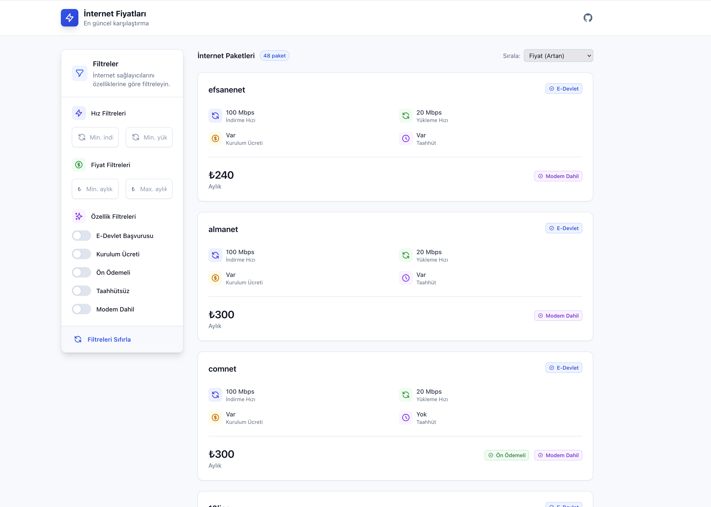

# İnternet Fiyatları

Türkiye'deki internet servis sağlayıcılarının fiyatlarını ve özelliklerini karşılaştıabileceğiniz modern bir web uygulaması.



## Özellikler

- **Hız Filtresi**: İndirme ve yükleme hızına göre filtreleme
- **Fiyat Filtresi**: Minimum ve maksimum fiyat aralığına göre filtreleme
- **Özellik Filtreleri**: 
  - Kurulum ücreti
  - E-devlet
  - Ön ödemeli
  - Taahhüt
  - Modem dahil
- **Responsive Tasarım**: Tüm cihazlarda mükemmel görünüm
- **Gelişmiş Arama**: Anlık filtreleme ve sonuç gösterimi
- **Akıllı Sıralama**: Fiyat ve hıza göre sıralama seçenekleri

## Teknolojiler

- [Astro](https://astro.build) - Web framework
- [TypeScript](https://www.typescriptlang.org) - Tip güvenli JavaScript
- [Tailwind CSS](https://tailwindcss.com) - CSS framework

## Kurulum

1. Repoyu klonlayın:
```bash
git clone https://github.com/yourusername/iss-prices.git
cd iss-prices
```

2. Bağımlılıkları yükleyin:
```bash
npm install
```

3. Geliştirme sunucusunu başlatın:
```bash
npm run dev
```

4. Tarayıcınızda açın:
```
http://localhost:4321
```

## Production Build

Production build almak için:

```bash
npm run build
```

Build dosyaları `dist/` klasöründe oluşturulacaktır.

## Katkıda Bulunma

1. Fork yapın
2. Feature branch oluşturun (`git checkout -b feature/amazing-feature`)
3. Değişikliklerinizi commit edin (`git commit -m 'feat: Add amazing feature'`)
4. Branch'inizi push edin (`git push origin feature/amazing-feature`)
5. Pull Request açın

## Lisans

Bu proje MIT lisansı altında lisanslanmıştır. Detaylar için [LICENSE](LICENSE) dosyasına bakın.

## İletişim

Ferdi Şahin - [@ferdisahin](https://twitter.com/ferdisahin)

Proje Linki: [https://github.com/yourusername/iss-prices](https://github.com/yourusername/iss-prices)
